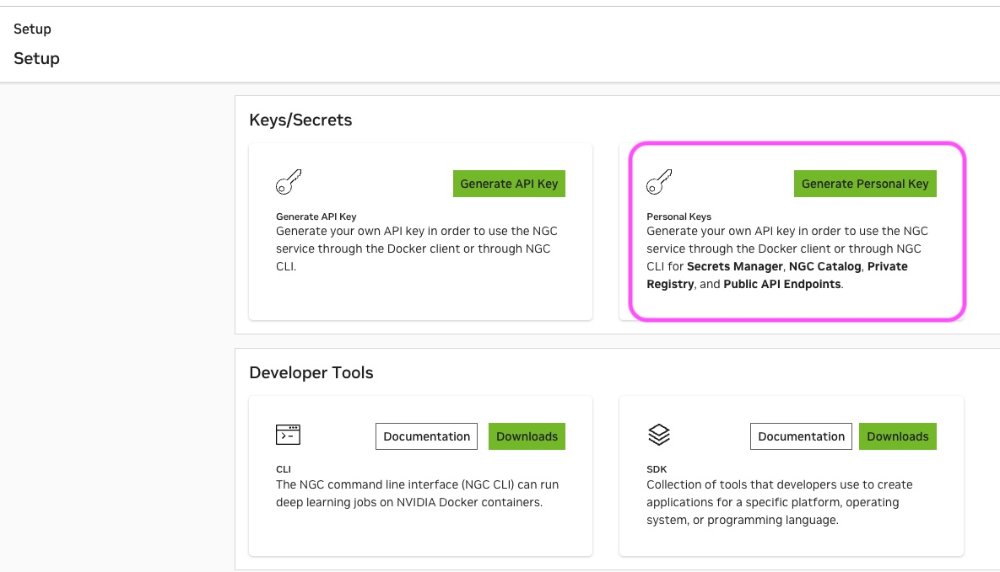
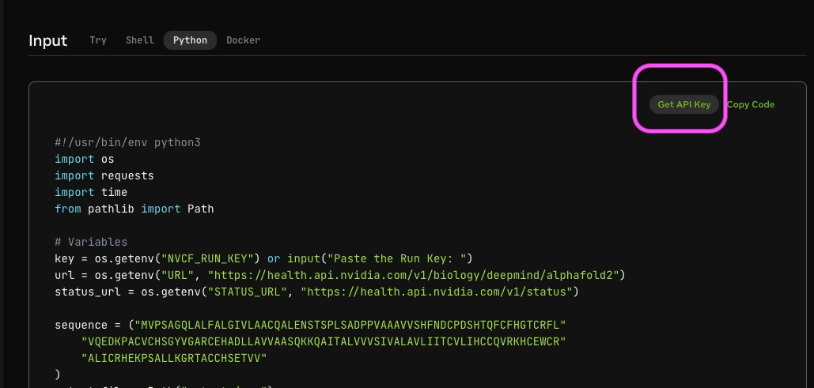

# Lab 1.0 Set up credentials


## 1. Get credentials to use outside of this workshop

> During this workshop, we provided an API key with existing access to various BioNeMo containers and hosted API endpoints in the playground. This API key will be deactivated post workshop. To get your free NGC API key outside of the workshop, please follow the following steps below.


### 1.1 Get NGC API key to download containers 

1. Create free NGC account [here](https://ngc.nvidia.com). 
2. Log into NGC account. Then click on user on top right corner, then setup
    
4. Click on **Generate API Key** 
    
5. Copy the API key. 
6. Install NGC CLI from [here](https://org.ngc.nvidia.com/setup/installers/cli) 
7. Open a terminal from your local machine, run `ngc config set`
   - **API key:** enter API key, 
   - **CLI output:** accept default (ascii) by pressing Enter 
   - **org:** Choose from the list the NGC org that you have access to
   - **team:** Select the team that you have access to, or simply press Enter to accept `no-team`
   - **ace:** Select the ACE F(compute cluster) you have access to, or simply press Enter to accept `no-ace`

### 1.2 Get NGC API key to use hosted API endpoints in the playground

Similar step as above, but choose **Generate Personal Key** instead



### 1.3 Alternative method to generate NGC API key to use hosted API endpoints in the playground

This method is similar to 1.2, but instead generates the API key directly in the playground. First, find any NIM at build.nvidia.com. Then click on **Get API Key**




## 2. Setting up environment for Lab 1.x

### 2.1 Conda environment

> For notebooks Lab 1.x, we will be using NIMs hosted by NVIDIA, with some locally installed models & packages. You will need a Linux environment with GPU support. 

1. In SageMaker Studio, create a new Jupyterlab space. The following configuration 
   A `g6e.8xlarge` instance with 100 GB EBS volume is recommended. 

2. Once you're inside the JupyterLab, clone the repository and cd into the directory
    ```bash
    git clone https://github.com/xinyu-dev/2025-01-biologic-summit-workshop.git
    ```
3. CD into the directory
    ```bash
    cd 2025-01-biologic-summit-workshop
    ```
4. Then run the following command to create a new conda environment called `workshop`
    ```bash
    bash setup.sh
    ```
5. Once the environment is created, you might need to run 
    ```bash
    conda init
    ```
6. Close the terminal, Then open a new one, and type
    ```bash
    conda activate workshop
    ```

### 2.2 API keys
1. Under the `2025-01-biologic-summit-workshop` directory, you should see a file called `env`. Open it and update it with your NGC playground API key. 
2. Rename this file to `.env` so that it can be loaded correctly. 


