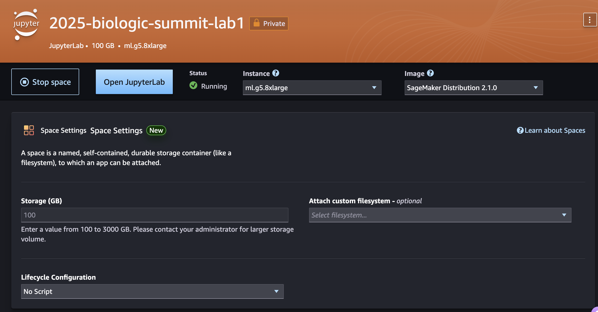

# Lab 1.0 Set up credentials


## 1. Get credentials to use outside of this workshop

> During this workshop, we provided an API key with existing access to various BioNeMo containers and hosted API endpoints in the playground. This API key will be deactivated post workshop. To get your free NGC API key outside of the workshop, please follow the following steps below.


### 1.1 Get NGC API key to download containers 

1. Create free NGC account [here](https://ngc.nvidia.com). 
2. Log into NGC account. Then click on user on top right corner, then setup
    
4. Click on **Generate API Key** 
    
5. Copy the API key. 
6. Install NGC CLI from [here](https://org.ngc.nvidia.com/setup/installers/cli) 
7. Open a terminal from your local machine, run `ngc config set`
   - **API key:** enter API key, 
   - **CLI output:** accept default (ascii) by pressing Enter 
   - **org:** Choose from the list the NGC org that you have access to
   - **team:** Select the team that you have access to, or simply press Enter to accept `no-team`
   - **ace:** Select the ACE F(compute cluster) you have access to, or simply press Enter to accept `no-ace`

### 1.2 Get NGC API key to use hosted API endpoints in the playground

Similar step as above, but choose **Generate Personal Key** instead


## 2. Setting up environment for Lab 1.x

> For notebooks Lab 1.x, we will be using NIMs hosted by NVIDIA, with some locally installed models & packages. You can run it on your laptop (MacOs and Linux tested) even without GPU support. 

1. In SageMaker Studio, create a new Jupyterlab space. The following configuration 
    
2. Once you're inside the JupyterLab, clone the repository and cd into the directory
    ```bash
    git clone https://github.com/xinyu-dev/2025-01-biologic-summit-workshop.git
    ```
3. CD into the directory
    ```bash
    cd 2025-01-biologic-summit-workshop
    ```
4. Then run the following command to create a new conda environment called `workshop`
    ```bash
    bash setup.sh
    ```
5. Once the environment is created, you might need to run 
    ```bash
    conda init
    ```
    Close the terminal, Then open a new one, and type

    ```bash
    conda activate workshop
    ```

## Setting up environment for Lab 2.x

Lab 2.x will utilize the BioNeMo Framework container for ESM2 training, finetuning, and inference, which has all the dependencies installed. Follow the steps below to set up the environment. 

1. Launch the BioNeMo Framework container. We provide example guides on: 
    - [AWS EC2](https://xinyu-nvidia.gitbook.io/bionemo-gitbook/framework-setup/platform/ec2)
    - [AWS SageMaker Studio](https://xinyu-nvidia.gitbook.io/bionemo-gitbook/framework-setup/platform/sagemaker-studio)
2. Once your inside the BioNeMo Framework container, cd into the `/workspace/bionemo` directory 
    ```bash
    cd /workspace/bionemo
    ```
3. git clone this repository
    ```bash
    git clone https://github.com/xinyu-dev/2025-01-biologic-summit-workshop.git
   ```
4. If we are doing model pretraining/finetuning/inference, the BioNeMo framework container has all the dependencies installed. There is no need to install conda or other virtual environment. You can skip the rest of the section. 

## License

### BioNeMo framework and NIM license

BioNeMo Framework is an open-source software. See [LICENSE](https://github.com/NVIDIA/bionemo-framework/blob/main/LICENSE/license.txt) for license details. 

All NVIDIA NIMs (BioNeMo, LLMs, etc) are free to evaluate. A NVAIE license is required for production usage. See [NVIDIA NIM FAQ](https://forums.developer.nvidia.com/t/nvidia-nim-faq/300317/1) for more details


### IgFold License

As of Dec 1, 2024, IgFold has the following license restrcitionL 

> The code and pre-trained models from this work are made available for non-commercial use (including at commercial entities) under the terms of the JHU Academic Software License Agreement. For commercial inquiries, please contact Johns Hopkins Tech Ventures at awichma2@jhu.edu.

See [IgFold Github Repository](https://github.com/Graylab/IgFold/tree/main?tab=readme-ov-file) for more information. 
